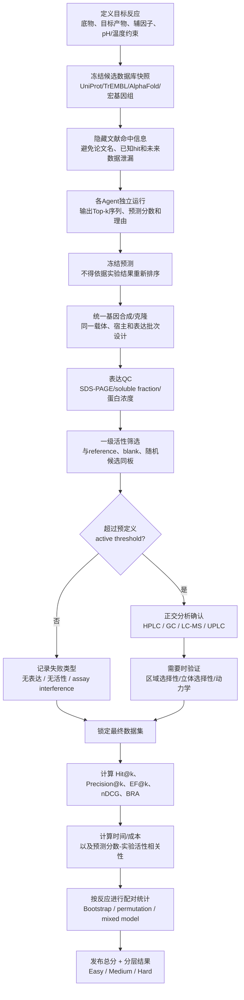

# 近两年“干实验主导”的酶挖掘文献与可复现实验 Benchmark 设计

## 执行摘要

本报告聚焦约 **2024 年 8 月 23 日至 2026 年 8 月 23 日**发表或公开的 enzyme mining / enzyme discovery 原始研究与预印本，筛选标准不是“用了机器学习就算”，而是更严格地要求：**候选酶主要由序列、结构、蛋白语言模型、机器学习、宏基因组计算筛选等干实验方法产生；随后作者对计算产生的候选做了明确的湿实验表达与活性验证。** 在这一标准下，本报告将 **8 项研究作为核心或边界纳入**：CataPro 的 4-vinylguaiacol 氧化酶挖掘、ESM-Ezy 的 multicopper oxidase 挖掘、VenusMine 的 PETase 挖掘、CA-KR1 的宏基因组 carbonic anhydrase 挖掘、VAE/EnzymeMiner 辅助的 tryptophanase 挖掘、基于金属配位几何的 Fe(II)/αKG halogenase 挖掘、Enzyme-tk/Func-e 的人造污染物降解酶挖掘，以及 CATNIP 的反应—序列空间预测。前六项最符合“干实验缩小搜索空间 → 少量实验验证”的定义；CATNIP 因前期建立了较大的实验筛选矩阵，属于边界案例。citeturn28search7turn1view1turn28search1turn17search0turn15search3turn28search2turn22search0turn12view0

从建立 **enzyme-mining agent 的实验 benchmark** 角度，最值得采用的并不是全部论文中“最漂亮”的反应，而是能形成难度梯度、底物易采购、检测方法明确、且具有已知阳性酶作为锚点的一组反应。本报告最终推荐一套 **8 个核心 benchmark**：

| 层级 | 推荐反应 | 主要考察能力 |
|---|---|---|
| 基础 | ABTS 氧化 | 能否找到典型但远缘的 MCO/laccase |
| 基础 | L-tryptophan → indole | PLP 酶挖掘、序列空间覆盖 |
| 基础/中等 | CO₂ → HCO₃⁻ | 宏基因组挖掘与稳定性约束 |
| 中等 | 4-vinylguaiacol → vanillin | 底物特异性及定量活性排序 |
| 中高 | PET → MHET + TPA | 聚合物底物、结构远缘发现 |
| 高 | L-aspartate → (3S)-chloro-L-aspartate | 新功能、区域/立体选择性 C–H 卤化 |
| 高 | biotin → (2R)-chlorobiotin | 复杂底物和高度选择性的非血红素铁酶 |
| 中高 | DEHP 水解 | 对训练集之外人造底物的反应泛化 |

其中，**4-vinylguaiacol、PET、L-aspartate 和 biotin 四组尤其适合区分强弱 agent**：CataPro 挖出的 SsCSO 比参考 CSO2 活性高约 19.5 倍；VenusMine 从数千万结构候选中选择 34 个实验测试并得到 14 个 PETase 活性阳性，其中 KbPETase 的热稳定性显著增强；金属配位挖掘则发现了 AspX 和 BtnX 两类此前难以靠序列同源直接识别的 Fe(II)/αKG 卤化酶，并分别实现 L-aspartate 与 biotin 的立体选择性氯化。citeturn2view0turn28search1turn1view2turn3view6turn28search2

**最重要的 benchmark 设计警告是文献泄漏。** 如果 agent 可以联网，而 benchmark 直接告诉它“4-vinylguaiacol → vanillin”，它可能直接检索到 CataPro 和 SsCSO，而非真正完成 enzyme mining。因此建议把测试拆为两个层次：第一层是 **literature reconstruction benchmark**，评估检索、条件恢复和复现实验能力；第二层才是决定 agent 水平的 **temporal/blind mining benchmark**——冻结至论文发表以前的 UniProt/TrEMBL/AlphaFold 数据快照，屏蔽论文名、命中酶名及其近邻注释，仅提供反应定义，让各 agent 在同一候选池、同一 top-k 预算下独立排序。VenusRXN 等 2026 年预印本本身也已采用 reaction-conditioned retrieval、top-k hit rate 和真正的 wet-lab zero-shot discovery，说明这种评测方向正在成为前沿。citeturn21search1turn21search2turn21search7

## 检索方法与纳入标准

### 检索窗口与数据库策略

时间窗定义为 **2024-08-23 至 2026-08-23**。实际核验优先顺序为：

**第一层：原始证据。** PubMed、Europe PMC、期刊出版社 HTML 全文、bioRxiv、ChemRxiv；对于关键序列和结构再交叉查询 UniProt、GenBank、RCSB PDB、Zenodo/GitHub。CataPro 可在 PubMed 和 Nature Communications 同时核验，发表日期为 2025-03-20、DOI 为 10.1038/s41467-025-58038-4；VenusMine PETase 论文于 2025-07-05 发表；金属配位挖掘论文于 2026-07-01 在线发表。citeturn28search3turn28search7turn28search1turn28search2

**第二层：召回检索。** Google Scholar/Web of Science 推荐使用相同布尔式进行复现；由于本次环境无法直接导出 Web of Science 或 Google Scholar 的完整结果集，因此这里不虚构“检索到 N 篇”的系统综述式 PRISMA 数量，而将这两者作为应复现的召回层。Europe PMC 对预印本尤其有用，例如 2026 年 family-specific ML enzyme exploration 已有 Europe PMC 预印本记录。citeturn20search6

推荐的核心检索式可直接改写至 PubMed、WoS 和 Google Scholar：

```text
("enzyme mining" OR "enzyme discovery" OR "enzyme prospecting"
 OR "biocatalyst discovery" OR "enzyme retrieval")
AND
("machine learning" OR "deep learning" OR "protein language model"
 OR "structure prediction" OR AlphaFold OR Foldseek
 OR metagenom* OR "sequence similarity" OR "sequence space")
AND
(experimental OR "wet lab" OR validation OR recombinant
 OR expression OR activity OR biocatal*)
```

对特定平台增加：

```text
site:biorxiv.org ("enzyme discovery" OR "enzyme mining")
    ("experimental validation" OR "wet-lab")

site:chemrxiv.org ("enzyme mining" OR "biocatalyst discovery")
    ("machine learning" OR "sequence space")
```

反应类补充检索则使用：

```text
("PET hydrolase" OR PETase) AND (mining OR discovery) AND
("protein language model" OR structure)

("Fe(II)/2OG" OR "Fe(II)/alpha-ketoglutarate")
AND halogenase AND (discovery OR mining)

tryptophanase AND (mining OR "sequence space" OR VAE)

"carbonic anhydrase" AND metagenom* AND mining
```

中文检索建议并行使用“酶挖掘 / 酶发现 / 蛋白语言模型 / 宏基因组酶挖掘 / 结构挖掘 / 生物催化剂发现”等词。此次严格筛出的原始实验研究主体仍为英文；检索中出现的中文资料主要是对 bioRxiv 等英文原文的二次解读，因此没有用中文二手文章替代原始实验数据。一个例子是 2026 年 family-specific ML 预印本在中文平台已有介绍，但原始证据仍应回到 bioRxiv。citeturn20search2turn20search22

### 纳入与排除原则

本报告将“干实验为主”操作化为以下标准：候选空间首先由计算方法显著缩小；实验阶段用于**验证计算预测**，而不是先做数千至数百万湿实验筛选后再训练模型。VenusMine 是非常典型的例子：流程从超过 3300 万候选出发，经结构检索、聚类和蛋白语言模型表示后最终选 34 个表达验证，14 个显示 PETase 活性。citeturn1view2

CataPro 同样属于强纳入项，因为模型预测动力学参数后才选择 PpCSO、MgpCSO、PgCSO、SsCSO、TkCSO 五个候选，最终 SsCSO 相对已知 CSO2 表现出约 19.53 倍活性。citeturn2view0

CATNIP 则列为“边界纳入”：论文建立了超过 300 个 αKG-dependent non-haem iron enzymes 的实验反应矩阵，随后利用连接化学空间与序列空间的模型做 prospective predictions；因此它非常适合拿来设计 benchmark，但不应与“只实验十几个计算候选”的工作等量看待。citeturn11view0turn12view0

此外，两篇非常值得持续关注但没有进入下面核心反应表的 2026 年预印本是 **VenusRXN / Reaction-Conditioned Enzyme Discovery with Multimodal Deep Learning** 和 **Data-Efficient Exploration of Enzyme Function Using Family-Specific Machine Learning**。前者从超过 3 亿蛋白中作 reaction-conditioned retrieval，并报告在 top-10 内找到可催化未报道反应的湿实验阳性酶；由于当前可稳定检索的公开文本没有充分暴露所有实验底物/产物细节，不把它强行填入需要“具体底物—产物—条件”的主表。citeturn21search1turn21search7turn20search2

### 三维评分标准

下文对每个反应使用三个独立指标，而非一个含混“总难度”。

**难度 D：** 低（1）表示简单商业底物、无立体化学要求、无辅酶或仅一个常用辅因子且可用直接光谱检测；中（2）表示需要一个或多个辅因子、HPLC/GC/LC-MS、聚合物或中等复杂底物；高（3）表示复杂底物、区域/立体选择性、C–H 官能化、多个共底物/金属或特殊分析要求。

**通用性 G：** 高（3）表示代表广泛常见的酶反应类型，如水解、氧化、氨基酸裂解；中（2）代表重要但家族限定的典型反应，如 PET 水解或 αKG-dependent hydroxylation；低（1）代表非常专一的新功能。

**可操作性 O：** 高（3）表示底物商业可得、普通 E. coli 表达和 UV/HPLC 即可完成；中（2）需要纯化酶、LC-MS、长时间孵育或底物处理；低（1）需要非商业标准品、复杂合成、严格厌氧/特殊仪器或难以确认立体构型。

## 文献与案例反应汇总

### 入选研究、挖掘方法与可获得性

| 研究 | 酶家族/目标 | 干实验挖掘策略 | 实验规模与对照 | 序列、质粒与数据可获得性 | DOI / 预印本 |
|---|---|---|---|---|---|
| **Wang 等，2025，Nature Communications，CataPro** | CSO；4-vinylguaiacol 氧化生成 vanillin | 深度学习预测 \(k_{cat}\)、\(K_m\)、\(k_{cat}/K_m\)，据此从同源序列中排序 | 实验验证 5 个重点候选；**CSO2 为已知参考**；SsCSO ≈19.53× CSO2。citeturn2view0turn28search7 | pET28a(+)、BL21(DE3) 表达；训练/验证数据 Zenodo、代码 GitHub。未发现公开质粒库实体沉积，因此“序列/数据可得，实体质粒未注明公开”。citeturn3view0turn3view1turn28search32 | https://doi.org/10.1038/s41467-025-58038-4 |
| **Qian 等，2025，Nature Communications，ESM-Ezy** | Multicopper oxidase；并测试向 L-asparaginase 泛化 | ESM-1b protein-language-model embedding / semantic-space mining | 多个低序列相似度 MCO 被表达；89% 测试酶可氧化 ABTS，44% 至少有一项性质优于 query enzyme；有 query/reference 对照。citeturn1view1 | 基因合成至 pET-28a 或 pET-28a-SUMO；结构 PDB 8Z5B、8Z59；代码/数据公开；实体质粒公开库未注明。citeturn3view2turn3view3 | Nature Communications 16, 3274 (2025)，出版社原文见引文。citeturn1view1 |
| **Wu 等，2025，Nature Communications，VenusMine** | PET hydrolase / PETase | Foldseek + MMseqs2 + ProstT5 / representation-tree，从结构及序列空间筛选 | 33,247,501 初始候选→436,488 去冗余→34 个实验→14 个活性 PETase；IsPETase 为核心参考。citeturn1view2 | KbPETase 来源 *Kibdelosporangium banguiense*；PDB 9IW9；代码 GitHub、数据 Zenodo。预印本披露相关专利申请 CN202410267798.X；实体质粒未注明公共库。citeturn3view5turn28search17 | https://doi.org/10.1038/s41467-025-61599-z；预印本 https://doi.org/10.1101/2024.11.13.623508 citeturn28search1turn28search5 |
| **Rigkos 等，2024，Environmental Science & Technology** | β-carbonic anhydrase CA-KR1 | 对 SRA/JGI 等宏基因组进行 in-house bioinformatic mining | 重组表达后做 CO₂ hydration、热稳定、强碱稳定及高温 K₂CO₃ CO₂ capture；有无酶对照。citeturn17search3turn17search18 | **ca-KR1：GenBank BK065798**；pET-28a(+)，E. coli Origami 2(DE3)；实体质粒未注明公开。citeturn17search7turn17search3 | https://doi.org/10.1021/acs.est.4c04291 |
| **de Boer 等，2026，ACS Omega / ChemRxiv** | PLP-dependent tryptophanase | EnzymeMiner 初筛 + SoluProt/NetSolP + VAE latent-space exploration | 21 个构建中 18 个可溶表达；先确认 tryptophanase 活性，再系统测 pH、温度、动力学；EcoTIL、VchTIL 等已知酶形成参考。citeturn15search3 | pET28a(+)、BL21 Star(DE3)；基因由 Biomatik 合成，序列来自公共数据库/补充材料；实体质粒未注明公共沉积。citeturn15search3 | https://doi.org/10.1021/acsomega.5c11382；ChemRxiv https://doi.org/10.26434/chemrxiv-2025-231k2 citeturn13search0turn15search3 |
| **Kipouros & Chang，2026，Nature** | Fe(II)/αKG-dependent halogenases；AspX、BtnX | AlphaFold2 大规模结构库中的**金属配位几何挖掘**，弱化对序列同源性的依赖 | AspX 与 BtnX 均有纯化酶、生化动力学和产物结构/选择性验证；还有 Br⁻、N₃⁻ 替代试验。citeturn1view5turn3view6turn2view12 | AspX UniProt **A0AAC9SM19**；BtnX **A8LT50**；PDB 9PV1、9Q04；代码 Zenodo/GitHub；实体质粒未注明公共库。citeturn3view7turn28search34 | https://doi.org/10.1038/s41586-026-10716-z citeturn28search2 |
| **Mora 等，2026，bioRxiv，Enzyme-tk** | 人工污染物水解/降解酶 | Enzyme-tk 整合 23 个开源工具；新模块 Func-e 做 reaction→enzyme ML search，Oligopoolio 降低大量候选基因构建成本 | 对 **DEHP 与 TPP** 两种人造污染物做前瞻性实验验证；TPP 使用 Sb-PTE 阳性对照。citeturn20search13turn22search0 | DEHP 命中之一为 UniProt **Q7SIG1**，来源 thermophilic *Bacillus acidocaldarius*；序列公共可得。Oligopoolio 构建数据见预印本；实体质粒公共沉积未确认。citeturn24search0 | https://doi.org/10.64898/2026.02.02.703255 |
| **Paton 等，2025，Nature，CATNIP** | αKG-dependent non-haem iron enzymes | 将化学反应空间与蛋白序列空间连接，预测 enzyme–substrate/reaction relationships | >300 酶统一 HTE 数据集；prospective tests 包括 sparteine、matridine、steroid、humulene 等。属于“计算+实验共主导”的边界项。citeturn11view0turn12view0 | 全库基因合成于 pET-28b(+)，数据 HuggingFace，代码 Zenodo；实体质粒公共沉积未注明。citeturn11view0turn12view2 | https://doi.org/10.1038/s41586-025-09519-5 citeturn12view0 |

### 所有主要前瞻性验证案例反应

下面的“未指定”严格表示：本次能稳定核验的主文 HTML/公开记录未提供足够参数；右侧若有“建议”则明确是 benchmark 设计建议，而不是冒充作者实验条件。

| 文献/案例 | 底物 → 产物 | 原文实验条件与关键指标 | 对照 | D / G / O |
|---|---|---|---|---|
| **CataPro** | **4-vinylguaiacol (4-VG) → vanillin + formaldehyde** | 200 μL；4-VG 60 mM；50 mM Na₂CO₃/NaHCO₃ pH 9.5；25°C、60 min；以甲醛显色 A480 定量。SsCSO 活性约为 CSO2 的 19.53×。citeturn2view2turn3view0turn2view0 | CSO2 | **中2 / 高3 / 高3** |
| **ESM-Ezy** | **ABTS → ABTS•⁺** | 50 mM citrate/NaOH pH 4.0，37°C；原文 assay 使用 ABTS 并在 420 nm 读取，ε≈36,000 M⁻¹cm⁻¹；动力学覆盖约 0.1–5 mM ABTS；1 U = 1 μmol·min⁻¹。citeturn2view5 | query MCO | **低1 / 高3 / 高3** |
| ESM-Ezy | **RBBR → 氧化/脱色产物** | 用于验证染料脱色能力；完整浓度组合在当前可核验主文摘录中未完整暴露，建议 benchmark 用 50–100 mg/L RBBR、pH 4–5、25–37°C、A595/LC-MS 双读数。论文确认其为 application test。citeturn1view1 | query MCO / no-enzyme | **中2 / 中2 / 高3** |
| ESM-Ezy | **chloramphenicol → 氧化降解产物** | 论文明确进行了 chloramphenicol degradation；完整公开摘录中条件未指定，适合 LC-MS 而非仅 UV。citeturn1view1 | no-enzyme/query | **中2 / 中2 / 中2** |
| ESM-Ezy | **aflatoxin B1 → 氧化降解产物** | 论文明确测试 AFB1 degradation；完整条件在当前可核验摘录中未指定。由于毒理和分析要求，不建议作为第一阶段 routine benchmark。citeturn1view1 | no-enzyme/query | **高3 / 中2 / 低1** |
| ESM-Ezy 方法迁移 | **L-asparagine → L-aspartate + NH₃** | 将 ESM-Ezy 扩展到 L-asparaginase 后，约 40% 测试候选在至少一项表现上优于 query；具体反应为 L-asparagine 水解。citeturn1view1turn2view6 | query L-asparaginase | **低1 / 高3 / 高3** |
| **VenusMine** 初筛 | **p-nitrophenyl butyrate → p-nitrophenol + butyrate** | 100 μL；0.8 mM pNPB；酶 100 μg/mL；10 mM potassium phosphate pH 8；37°C 10 min；乙醇终止；A410；triplicate。citeturn3view4 | IsPETase/no-enzyme | **低1 / 中2 / 高3** |
| VenusMine 主验证 | **PET → MHET + TPA** | Goodfellow amorphous PET film，6-mm disc；2.9 mL 50 mM glycine-NaOH pH 9 + 0.1 mL 0.5 mg/mL enzyme stock，即 final enzyme ≈0.0167 mg/mL；30–65°C；72 h；UPLC 定量 MHET+TPA。citeturn2view9 | IsPETase | **中2 / 高3 / 中2** |
| **CA-KR1** | **CO₂ + H₂O ⇌ HCO₃⁻ + H⁺** | 色度法以 phenol red 检测 CO₂ hydration；动力学用 stopped-flow，25°C、起始 pH 8.3；CA-KR1 \(k_{cat}\)≈1.2×10³ s⁻¹、\(K_M\)≈4.9 mM。citeturn17search3turn15search6 | no-enzyme；已知 CA | **低1 / 高3 / 中2** |
| CA-KR1 工业条件 | **CO₂ → carbonate/bicarbonate capture** | 20% w/v K₂CO₃、7 bar；20–90°C。90°C 时 CA-KR1 使 CO₂ absorption productivity 提高约 93%，初始吸收速率约从 2.5 增至 5.0 mmol CO₂ L⁻¹min⁻¹。citeturn15search6turn17search3 | nonenzymatic K₂CO₃ | **高3 / 中2 / 低1** |
| **Tryptophanase mining** | **L-Trp → indole + pyruvate + NH₃** | 标准化比较：1 μM TRPase、5 mM L-Trp、50 μM PLP、pH 7、30°C、10 min；n=4。最佳温度通常 45–55°C，AsoTIL optimum 65°C。citeturn15search3 | EcoTIL/VchTIL 等 | **低1–中2 / 高3 / 高3** |
| Tryptophanase cascade | **L-Trp → indole → indigo** | 50 mM L-Trp、1 μM PreTIL、25 μM MvFDH、50 μM MaFMO、20 μM PLP、2 mM NADP⁺、575 mM K-formate、25 mM K-phosphate pH 8.2；约 3 h 达 **3.0±0.8 mM indigo**。citeturn15search3 | 单酶/级联组件对照 | **高3 / 中2 / 中2** |
| **AspX** | **L-aspartate → (3S)-chloro-L-aspartate** | 25 μM AspX、500 μM L-Asp、50 mM HEPES pH 7.5、1 mM Fe²⁺、5 mM αKG、5 mM ascorbate、100 mM NaCl，空气条件，2 h；\(k_{cat}\)=33.3±0.5 min⁻¹、\(K_M\)=0.64±0.02 mM、TON≈780±107。citeturn3view6turn2view13 | no-enzyme/controls | **高3 / 中2 / 中2** |
| AspX alternative group transfer | **L-Asp → brominated / azidated L-Asp** | 论文进一步证明 Br⁻ 或 N₃⁻ 可替代 Cl⁻；为 mechanistic/generalization test，不建议作为首轮 benchmark。citeturn2view12 | chloride reaction | **高3 / 低1 / 中2** |
| **BtnX** | **biotin → (2R)-chlorobiotin** | 立体选择性氯化；\(k_{cat}\)≈0.96±0.02 min⁻¹，\(K_M<2\) μM，TON≈22±6；产物结合结构 PDB 9Q04。citeturn2view12turn28search34 | no-enzyme/control | **高3 / 中2 / 中2** |
| BtnX alternative group transfer | **biotin → bromobiotin / azidobiotin** | Br⁻ 或 N₃⁻ 作为替代阴离子；扩展实验使用 100 mM bromide 或 10 mM azide、约 2 h、LC-QTOF。citeturn2view12 | chloride reaction | **高3 / 低1 / 中2** |
| **Enzyme-tk** | **DEHP → 一级酯水解产物** | Func-e/Enzyme-tk 预测后实验验证；命中之一 Q7SIG1 来自 thermophilic *B. acidocaldarius*。当前稳定检索文本未给出完整 assay recipe，故不伪造作者条件。citeturn22search1turn24search0 | literature enzyme / no-enzyme | **中2 / 高3 / 中2** |
| Enzyme-tk | **triphenyl phosphate (TPP) → phosphate-ester hydrolysis products** | 论文实验验证 TPP degradation，**Sb-PTE 为阳性对照**；完整反应配方当前可核验摘要未指定。citeturn22search0 | Sb-PTE | **中2 / 高3 / 中2** |
| **CATNIP prospective** | **sparteine → hydroxylated sparteine** | top predictions 中 7/10 有活性；50-mg preparation 的最佳反应获得约 **35% isolated yield**。统一 HTE 条件见下。citeturn11view0 | panel / negative pellets | **高3 / 中2 / 中2** |
| CATNIP | **matridine → (12S)-hydroxymatridine** | 7/10 predicted enzymes productive；preparative reaction ≈**50% isolated yield**。citeturn11view0 | 同上 | **高3 / 中2 / 中2** |
| CATNIP | **6-methyleneandrost-4-ene-3,17-dione → oxidative alkene-cleavage product** | 7/10 有产物；目标裂解产物约 **12% yield**。citeturn11view0 | 同上 | **高3 / 中2 / 中2** |
| CATNIP | **humulene → 单一氧化产物**，NHI177 | ≈**41% conversion**；说明模型可把已知酶推向新底物。citeturn11view0 | negative controls | **高3 / 中2 / 中2** |
| CATNIP | **NHI123 + predicted substrate 22 → oxidized product** | 4/10 predicted substrates 被氧化；最佳例约 **7% conversion**。citeturn11view0 | no-substrate / empty pellet | **高3 / 中2 / 中2** |
| CATNIP | **TqaL + predicted substrate 23 → oxidized product** | 外部验证中 4/12 predicted substrates productive；第二排名 substrate 23 约 **42% conversion**。citeturn11view0 | empty-pellet/no-substrate | **高3 / 中2 / 中2** |

CATNIP 的统一初筛条件值得直接借鉴作为 agent benchmark 的 αKG-oxygenase 标准化底盘：50 μL、底物 1 mM、50 mM TES pH 7.5、αKG 2 mM、sodium ascorbate 1 mM、FeSO₄ 0.1 mM、whole-cell pellet 约 40% v/v，并加入 10% v/v toluene，之后 LC-MS 分析；作者使用 triplicate，并包含 empty-pellet 与 no-substrate controls。citeturn11view0

上述表格还揭示一个重要趋势：**越能真正区分 enzyme-mining 算法的反应，往往越不能只用 absorbance readout。** ABTS、pNPB 适合做“系统是否正常”的低难度校准；PET、4-VG 以及 Fe/αKG halogenation 则分别要求产物级 HPLC/UPLC/LC-MS 证据，后者还包含区域/立体选择性，因此更难被“搜到一个大类酶”蒙混过关。citeturn2view5turn3view4turn2view9turn3view6

## 推荐的核心 Benchmark 案例集合

建议采用 **8 项核心 benchmark + 若干可选扩展反应**。CAS 号的作用主要是避免采购时因盐型、异构体或商品名导致混淆；实际库存和纯度应在执行实验时重新核对。PET 可直接沿用论文采用的 Goodfellow amorphous PET film；Goodfellow 当前仍提供 PET films/sheets，PET 的 CAS 为 25038-59-9。citeturn2view9turn27search1

### 推荐实验矩阵

| Benchmark | 推荐底物及来源 | 推荐阳性酶/基因锚点 | 推荐标准化条件 | 首选可比指标与检测 | 资源/时间估算 |
|---|---|---|---|---|---|
| **B1：MCO/ABTS oxidation** | ABTS diammonium salt，CAS **30931-67-0**；常规生化试剂商 | ESM-Ezy “Sulfur”等 SI 候选；另保留论文 query enzyme | 50 mM citrate-NaOH，pH 4.0；ABTS 建议 0.5–2 mM 做统一 benchmark；37°C；Cu-loaded recombinant enzyme | 初速 \(U/mg\)、\(k_{cat}/K_M\)；**A420**。论文定义 1 U=1 μmol/min。citeturn2view5 | 基因到手后 4–5 calendar days；约 2–3 person-days/10 candidates |
| **B2：Tryptophanase** | L-tryptophan，CAS **73-22-3** | **PreTIL** 或论文高活性 mined TIL；EcoTIL/VchTIL 为 reference | **5 mM L-Trp、50 μM PLP、1 μM enzyme、pH 7、30°C、10 min**，完全复制论文标准化条件。citeturn15search3 | indole formation rate；HPLC-UV；可辅以 indole colorimetry；relative activity vs EcoTIL | 4–5 days；2–3 person-days |
| **B3：Carbonic anhydrase** | CO₂，CAS **124-38-9**；CO₂-saturated water | **CA-KR1，GenBank BK065798**；已知 commercial CA 作 assay control | 推荐先用低成本 phenol-red CO₂ hydration assay，pH≈8.3；若有 stopped-flow，再做 25°C kinetics。作者 \(k_{cat}\)≈1.2×10³ s⁻¹。citeturn17search3turn17search7 | hydration time / WAU、\(k_{cat}\)、\(K_M\)，以及 80°C pre-incubation residual activity | 4–6 days；无需 LC-MS，但严格 CO₂ 饱和操作是关键 |
| **B4：4-VG → vanillin** | 4-vinylguaiacol，CAS **7786-61-0** | **SsCSO**；reference **CSO2** | 优先完全复制：60 mM 4-VG、50 mM carbonate/bicarbonate pH 9.5、25°C、60 min；论文表达时加入 **1 mM FeCl₂**。citeturn3view0turn2view2 | A480 formaldehyde assay 做 HT 初筛；**HPLC/LC-MS vanillin** 作正交确认；activity ratio vs CSO2，预期 SsCSO ≈19.5× reference。citeturn2view0 | 4–6 days；3 person-days |
| **B5：PET hydrolysis** | Amorphous PET film，CAS **25038-59-9**；优先 Goodfellow，与原论文材料统一。citeturn27search1turn2view9 | **KbPETase**；reference **IsPETase** | 6-mm disc；50 mM glycine-NaOH pH 9；final enzyme ≈0.0167 mg/mL；建议 benchmark 固定 50°C + 可选 60°C challenge；**72 h**。原文 30–65°C 扫描。citeturn2view9 | UPLC/HPLC：TPA、MHET；总 soluble product μmol、μmol·mg⁻¹ enzyme、残余 activity；pNPB 只能做 QC，不作为最终判定 | 7–9 calendar days；3–4 person-days；关键是统一 PET batch |
| **B6：AspX chlorination** | L-aspartic acid，CAS **56-84-8** | **AspX, UniProt A0AAC9SM19** | 25 μM enzyme、0.5 mM L-Asp、50 mM HEPES pH7.5、1 mM Fe²⁺、5 mM αKG、5 mM ascorbate、100 mM NaCl、空气、2 h。citeturn3view6 | LC-MS conversion；若要严格复现“3S”则增加 chiral analysis/NMR；可报告 TON，文献约 780。citeturn3view6 | 5–7 days；3–4 person-days；αKG、fresh Fe²⁺、LC-MS |
| **B7：BtnX biotin chlorination** | D-biotin，CAS **58-85-5** | **BtnX, UniProt A8LT50** | 建议以 AspX 的 Fe²⁺/αKG/ascorbate base recipe 为起点，再按 BtnX 原文做底物低 μM–亚 mM 梯度；作者测得 \(K_M<2\) μM，因此不应机械使用过高底物浓度。citeturn2view12 | LC-MS/QTOF conversion + chlorinated isotope pattern；高水平 benchmark 再确认 **2R** stereochemistry；\(k_{cat}\) 文献约 0.96 min⁻¹。citeturn2view12turn28search34 | 5–8 days；LC-QTOF 最佳；产品标准不易获得是主要瓶颈 |
| **B8：DEHP hydrolysis** | Di(2-ethylhexyl) phthalate，CAS **117-81-7** | **Q7SIG1**，thermophilic *Bacillus acidocaldarius*；来源 UniProt。citeturn24search0 | 作者完整 recipe 当前检索文本未指定。**建议**：50 mM phosphate/HEPES pH 7.5–8.0；25–37°C；DEHP 0.1–0.5 mM；1–5% DMSO；1–4 h；先做 cosolvent tolerance control | LC-MS/GC：DEHP disappearance + monoester/alcohol product；转换率、初速；no-enzyme 和 heat-denatured enzyme 必须有 | 5–7 days；3–4 person-days；疏水底物处理是主要误差源 |

这里有两个有意的设计选择。

第一，**ABTS 不应获得过高权重。** ESM-Ezy 的实验很好地说明 PLM embedding 能在低序列同一性空间找到新 MCO，但 ABTS 是大量 laccase/MCO 都能氧化的经典 chromogenic substrate，因此 Hit@10 很容易饱和。它最适合做 assay/system calibration，不适合单独证明 agent 很强。citeturn1view1turn2view5

第二，**AspX/BtnX 应给予最高区分权重。** 这项工作本身就是因为某些 halogenase 的序列保守性不足以直接支持常规 homology retrieval，才转向 AlphaFold 结构库中的 Fe(II) metal-coordination geometry。AspX 还能以较高 TON 做 free L-aspartate chlorination，而 BtnX 在 biotin 上展示明确 stereoselectivity；这种任务能区分“找对 EC 类别”和“找对真正催化该反应的酶”。citeturn1view5turn3view6turn2view12

### 建议的阳性、阴性与梯度控制

每个 benchmark 不应只有“agent 候选 vs blank”。建议至少保留三种锚点：

**阳性 reference**：论文中既有酶，如 CSO2、IsPETase、EcoTIL/VchTIL 或已知 CA；它用于跨批次 normalization。CataPro、VenusMine 和 tryptophanase 工作都采用了这种比较思路。citeturn2view0turn2view9turn15search3

**阴性过程控制**：empty vector/empty pellet、heat-inactivated enzyme、no-enzyme。CATNIP 的 HTE 特别明确设置了 empty-pellet 与 no-substrate controls，可以直接移植。citeturn11view0

**随机候选基线**：从与 agent 相同的候选数据库和相同基本过滤条件中随机抽取 k 条。这一点原论文通常不会替你做，但对于评价 agent 至关重要，因为它决定 enrichment factor 的分母。如果随机 10 条已有 5 条活性，而 agent 10 条有 6 条，“6/10 命中”本身并不强；如果随机阳性率仅 1%，agent 的 6/10 就是巨大 enrichment。

### 可获得性风险

从复现角度，**CA-KR1 和 AspX/BtnX 最干净**：分别有 GenBank BK065798 和 UniProt A0AAC9SM19/A8LT50，可直接从公开序列重新合成；BtnX 还有 product-bound PDB 9Q04。citeturn17search7turn3view7turn28search34

CataPro、ESM-Ezy、VenusMine 和 tryptophanase 工作均给出了表达载体或公开数据/补充信息，但本次未发现它们将作者实际使用的实体 plasmid 明确沉积到 Addgene 等公共质粒库，因此 benchmark 最稳妥的做法是**按公开氨基酸序列统一重新 codon-optimize 并合成**，而不是假设可以直接索取原质粒。CataPro 的数据集已公开到 Zenodo，VenusMine 亦公开了代码/数据。citeturn3view1turn3view3turn3view5turn28search32

PET 还有一个额外可复现性风险：PET 的结晶度、膜厚、预处理和 lot 会显著影响表观水解，因此对不同 agent 必须使用**同一批 Goodfellow film**，不要把“某 agent 候选在不同 PET 材料上测得更高”作为模型差异。原论文明确使用 Goodfellow 的 amorphous PET film，并以 MHET+TPA 进行 UPLC 定量。citeturn2view9

## Agent 的量化评估与统计设计

### 首先区分三种 benchmark 模式

最推荐的框架不是把所有测试混成一个数字，而是分成：

**重建模式（reconstruction）**：允许 agent 访问论文、Google Scholar、PubMed 等。输入反应，评价它是否能找到正确论文、提取正确序列、条件、对照和检测方案。这测试的是 **research-agent 能力**，不是纯 enzyme-mining model。

**盲挖模式（blind mining）**：不给论文标题、酶名、UniProt 命中；所有 agent 获得完全相同的 target reaction 与固定 candidate database snapshot，只允许输出 top-k sequences。这才测试 **enzyme mining**。

**时间外推模式（temporal holdout）**：最严格。对于 2025 年发现的 KbPETase，候选数据库使用论文发表/预印本前已经存在的序列快照，但 agent 的检索知识库截止于论文之前；2026 AspX/BtnX 同理。这可以大幅降低“模型背过论文”的风险。VenusRXN 之类 reaction-conditioned enzyme retrieval 论文已经将 top-k hit rate 用作核心指标，并强调从大规模序列空间找 top-ranked active candidates，因此该指标与当前领域方法具有直接可比性。citeturn21search1turn21search2

真正用于对外声称 agent superiority 时，建议最终再加入 2–5 个**未发表内部反应**。出版案例最适合开发和校准；未发表案例才是防止训练数据泄漏的金标准。

### 核心量化指标

设反应 \(i\) 的 agent 排名前 \(k\) 个候选为 \(e_{i1}\ldots e_{ik}\)，实验活性为 \(y\)。

**Hit@k**

\[
Hit@k_i =
I\left(\max_{j\le k}y_{ij}\ge T_i\right)
\]

其中 \(T_i\) 必须在看结果前固定。推荐“同时超过 blank 的 assay-specific detection threshold，且达到 reference enzyme 的某一预设比例”，而不是实验后临时改阈值。

总体：

\[
Hit@k = \frac{1}{N}\sum_i Hit@k_i
\]

应至少报告 **Hit@1、Hit@3、Hit@5、Hit@10**。VenusRXN 等近期工作也使用 top-k hit/retrieval metrics。citeturn21search2

**Precision@k**

\[
Precision@k_i =
\frac{\#\{\text{active sequences among top k}\}}{k}
\]

它比 Hit@k 更严格：两个 agent 都可能在 top-10 找到一个 hit，但一个找到 8 个，另一个只找到 1 个。

**Enrichment Factor**

如果随机基线活性比例为 \(p_{base}\)：

\[
EF@k=\frac{Precision@k}{p_{base}}
\]

这是我最建议加入的指标，因为不同 reaction family 的天然 hit rate 差异极大。

**Best Relative Activity**

\[
BRA_i = \max_{j\le k}
\frac{activity(e_{ij})}{activity(reference_i)}
\]

对 CataPro 型 benchmark 特别有信息量：agent 不只是“找到一个会反应的”，还应尽量找到类似 SsCSO 那样显著超过 reference 的候选。SsCSO/CSO2 的公开比值约 19.53。citeturn2view0

**Ranking–activity correlation。** 对 agent 实际测试的 top-k 候选计算预测分数与

\[
\log(1+activity/reference)
\]

之间的 **Spearman \(\rho\)**，并辅以 Kendall \(\tau\)。如果模型声称输出定量预测值，再报告 Pearson \(r\)、MAE/RMSE 或 calibration；如果只是 ranking model，不应强迫使用 Pearson。

**nDCG@k。** 将实验活性分档，例如 inactive=0、weak=1、reference-like=2、better-than-reference=3，可计算 normalized discounted cumulative gain。它能奖励“真正高活性酶排在前几名”，比简单 Hit@k 更符合实际开发价值。

**新颖性应单独报告，而不建议直接作为活性主分。** 可报告 hit 与训练/参考酶之间的最大 sequence identity、Foldseek/TM similarity，或是否跨 family/subfamily。VenusMine 和 metal-coordination mining 的重要价值之一正是在低序列相似度区域寻找功能酶。citeturn1view2turn1view5

**时间与成本指标**建议记录：

\[
CostPerHit =
\frac{\text{total experimental + compute cost}}{\# active hits}
\]

以及 `calendar days to first confirmed hit`、`person-hours per confirmed hit`。这类指标对 agent 尤其重要，因为一个提高 Hit@10 5% 但让每次搜索成本增加 100 倍的系统未必更实用。

### 推荐的 100 分综合评分

综合分最好只用于 dashboard；论文式比较必须同时报告原始指标。一个实用配置是：

| 指标 | 权重 |
|---|---:|
| Hit@10 / reaction-level success | 30 |
| nDCG@10 | 20 |
| Best relative activity | 20 |
| Precision / enrichment factor | 15 |
| 预测分数–实验活性相关性 | 10 |
| 时间/成本效率 | 5 |

不建议把“序列新颖性”直接加到这 100 分，否则 agent 可能通过刻意返回远缘但无活性的蛋白刷分。更合理的是将 novelty 作为独立坐标，例如“Hit@10 = 75%，active hits median identity to known enzyme = 24%”。

另外应发布一个**按难度分层的分数**：

\[
Score =
0.2S_{low}+0.35S_{medium}+0.45S_{high}
\]

这样 ABTS 之类容易任务不会掩盖 agent 在 biotin chlorination 等真正困难任务上的失败。这一权重是本报告提出的 benchmark 设计建议，而非文献既有标准。

### 重复数、随机化与统计检验

湿实验最少建议 **3 个独立 biological replicates**，这里的 replicate 应指独立表达/培养/制备批次，而不是同一蛋白溶液在 96-well plate 上读三次。ESM-Ezy 的实验至少做 triplicate；CATNIP 也采用 triplicate 和明确阴性对照。citeturn3view3turn11view0

技术重复可每个 biological replicate 做 2 wells，但统计上的 \(n\) 仍然是 biological replicate 数，不应把 3×2 wells 写成 \(n=6\)。

对于两个 agent A/B，建议采用**同一组反应、相同 top-k 预算的 paired design**。如果两者候选有重叠，实际只需表达一次，再将同一实验活性反馈到各自 ranking 上，这既减少成本，也避免 batch confounding。

统计检验建议如下：

- 对每个 reaction 的二元“是否至少一个 hit”：两 agent 用 **McNemar test**；超过两个 agent 可用 Cochran's Q，再做 Holm-corrected pairwise comparisons。
- 对 per-reaction Precision@k、nDCG、BRA：样本数只有 8–12 个 benchmark 时，优先 **paired permutation test 或 Wilcoxon signed-rank**，同时报告 median paired difference 和 bootstrap 95% CI。
- 对候选级连续活性：不要把几十个候选当作彼此独立的 reaction tasks。推荐 mixed-effects model，例如  
  \[
  \log(1+y)\sim Agent+Difficulty+(1|Reaction)
  \]
  并在必要时加入实验 batch/random effects。
- 对多 agent、多指标比较，优先 Holm family-wise correction；大量探索性终点可用 Benjamini–Hochberg FDR。

**样本量方面，8 个核心反应足够做 pilot/ranking benchmark，但不足以支持强统计结论“Agent A 普遍优于 Agent B”。** 原因是统计独立单位主要是“反应任务”，而非每个 enzyme well。正式 superiority claim 建议扩展至至少约 **20–30 个独立 reaction tasks**，最好跨 hydrolase、oxidoreductase、PLP enzyme、metalloenzyme、polymer-active enzyme 等类别；8–12 个任务时应重点报告 effect size 和置信区间，而非只追逐 \(p<0.05\)。

### 如何公平构建 candidate pool

为了避免 benchmark 退化为 BLAST 和记忆题，建议每个反应维护三套候选池：

**Pool A：unrestricted database。** 模拟真实应用，数百万至数亿序列。

**Pool B：remote-homology challenge。** 去除与已知阳性酶 sequence identity >40% 的近邻，考察 PLM/structure/reaction-level reasoning。

**Pool C：hard-negative pool。** 加入结构相似但功能不同、相同 EC 前三级但底物不同、或同 family 的 inactive proteins。真正强的 enzyme-mining agent 应能在这里处理 activity cliffs。

最终至少报告：

\[
Hit@10_{A},\quad Hit@10_{B},\quad Hit@10_{C}
\]

而不是只有一个容易被近同源序列主导的平均值。

## Benchmark 实验流程



流程中最关键的两个“锁”是 **冻结预测** 和 **正交分析确认**。前者防止 agent 在看到第一批失败结果后变成 active-learning system，从而与一次性 mining agent 不可比；若确实要测 active-learning agent，则应另开赛道，所有系统给予相同轮数和每轮实验预算。后者防止色素、浑浊、底物自发氧化等 assay artifacts 被当作“活性”。CATNIP 的 empty-pellet/no-substrate controls 和 VenusMine 的 UPLC product quantification 都是值得借鉴的设计。citeturn11view0turn2view9

实际执行还应对实验人员**盲化 agent identity**：样品用随机编码，HPLC/LC-MS 分析完成后再揭盲。这样可以减少人工挑峰、重测或阈值判断对某一 agent 的无意识偏倚。

## 结论与可操作建议

过去约 24 个月的高质量 enzyme mining 工作呈现出非常明确的方法学变化：**从单纯序列同源搜索，转向 PLM embedding、结构检索、reaction-conditioned representation、动力学预测和结构化学约束的组合。** CataPro 直接把 kinetic-parameter prediction 用于候选排序；ESM-Ezy 用 protein language model semantic space 扩大 MCO 的可搜索序列空间；VenusMine 把 Foldseek、MMseqs2 与 ProstT5 串成大规模 PETase 挖掘漏斗；Kipouros 与 Chang 则进一步说明，在序列信号不足的情况下，直接挖掘 AlphaFold 结构中的 metal-coordination geometry 可以发现全新的酶功能。citeturn28search7turn1view1turn1view2turn1view5

对于验证一个 enzyme-mining agent，本报告建议**不要一开始就做 8 个 benchmark 的所有 top-10 候选**。更高效的实施顺序是：

**第一批做 B1、B2、B4：ABTS、tryptophanase、4-VG。** 这三者成本低，能迅速检查 agent 的基本 sequence/function retrieval、实验表达与 assay pipeline 是否正常。尤其 4-VG 有 CSO2→SsCSO 约 19.5× 的明确性能梯度，不仅能测“是否命中”，还能测排序质量。citeturn2view0turn2view5turn15search3

**第二批做 B5 与 B8：PET、DEHP。** 它们把测试从可溶小分子扩展到聚合物和人造污染物，开始考察 agent 是否能泛化到不典型底物。VenusMine 34 个实验候选中 14 个有 PETase 活性，提供了很好的“命中率而非单个英雄酶”的参照体系；Enzyme-tk 则明确把 DEHP/TPP 作为与训练空间不相似的人造污染物目标。citeturn1view2turn22search4

**第三批做 B6/B7：AspX 与 BtnX。** 这是最能拉开 agent 水平的一组。任务要求的不再是“检索出一个 Fe/αKG enzyme”，而是找到可以针对具体 free amino acid 或 biotin 完成立体选择性 halogenation 的蛋白。AspX 的 UniProt A0AAC9SM19、BtnX 的 A8LT50 和 PDB 9Q04 都让 ground truth 足够明确，同时候选的功能又不是一个普通 BLAST 题。citeturn3view7turn28search34

实验预算上，以**每个 agent 每个反应 top-10、两个 agent、候选取并集、3 个独立表达批次**为例，8 个 benchmark 理论上最多涉及 160 个不同 candidate genes，但实际因不同 agent 候选重合通常较少于该上限。若用 96-deep-well 表达、统一 Ni-affinity 或 crude-lysate primary screen，可先把真正需要精细纯化和 LC-MS 的候选压缩至每个 reaction 3–5 个。基因已经合成的情况下，基础反应从表达至确认通常约 4–6 个日历日；PET 因 72 h reaction 通常需约 7–9 天；halogenase 因 LC-MS 和选择性确认约 5–8 天。这里是用于规划的资源估算，并非原论文报告的 turnaround time。

最值得固定下来的 **benchmark v1.0 最小集合** 是：

> **ABTS / MCO + L-Trp / tryptophanase + 4-VG / CSO + PET / PETase + CO₂ / CA + L-Asp / AspX + biotin / BtnX + DEHP / hydrolase。**

这八项覆盖了无辅酶或金属酶、PLP 酶、Cu enzyme、Fe-dependent oxygenase、聚合物水解、人造化学品降解；覆盖 absorbance、HPLC/UPLC、LC-MS 三个检测层级；同时从极易命中的经典氧化一直延伸至高度选择性的非血红素铁 C–H halogenation。其难度跨度足以防止“某一个 enzyme family 特别强”支配总分。citeturn2view5turn15search3turn2view0turn2view9turn17search3turn3view6turn2view12turn24search0

最终评价时，**最有解释力的主终点建议设为 `Hit@10 + nDCG@10 + Best Relative Activity + EF@10`，而不是单独 accuracy。** 对真正的 enzyme-mining agent，理想结果不是“找回论文里的那个 accession”，而是：在论文公开之前即可获得的巨大候选空间中，以很低的实验预算持续富集真正有活性的序列，并把更高活性、更合适性质的候选排在最前面。近两年的 CataPro、VenusMine、metal-coordination mining、Enzyme-tk 以及 reaction-conditioned VenusRXN 的共同发展方向，恰好支持把 benchmark 从“功能注释准确率”升级到这种 **prospective, top-k, experimentally verified enzyme discovery** 评价。citeturn28search7turn28search1turn28search2turn20search13turn21search7